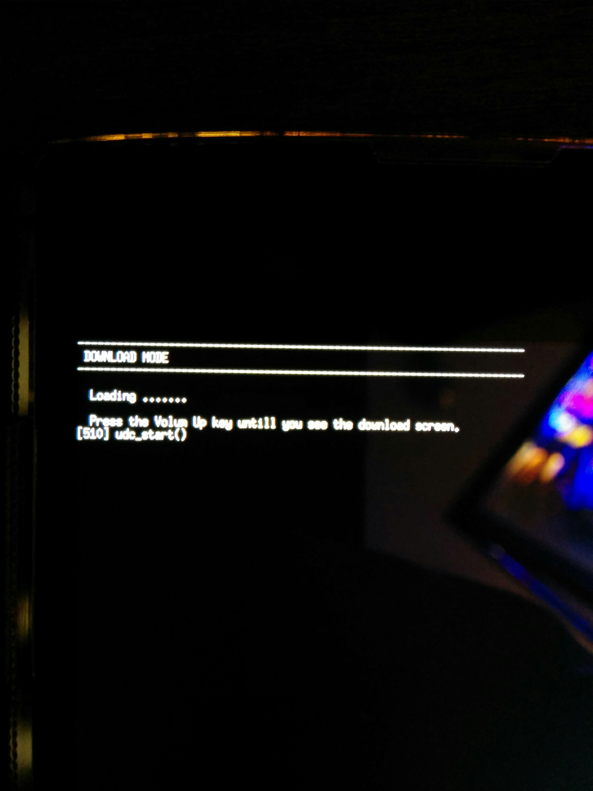
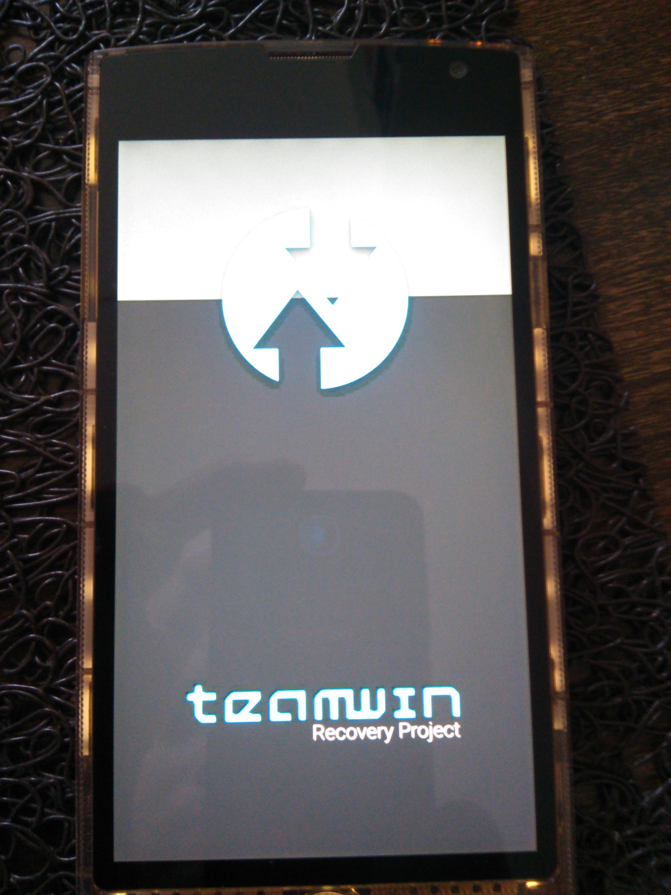
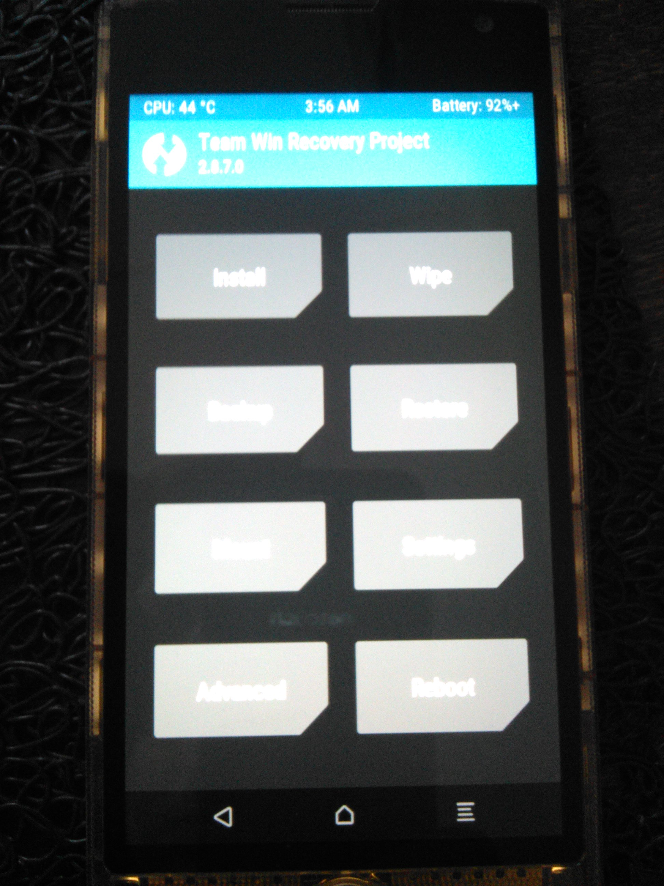
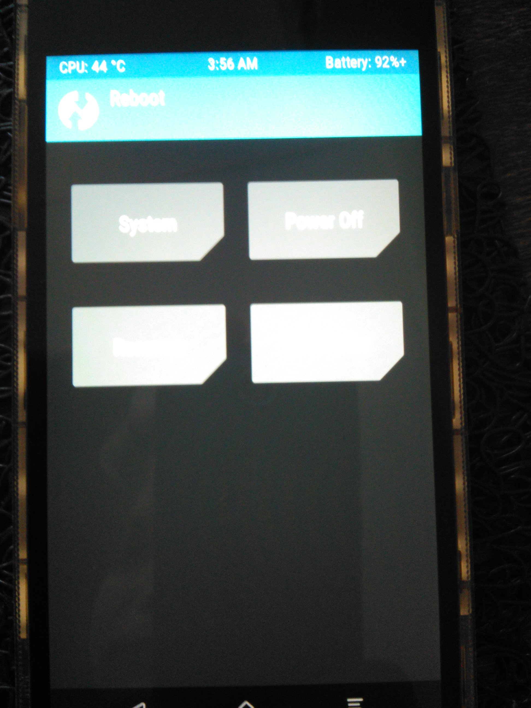

# Update Instructions for Firefox OS 2.6 on an fx0 (LGL25)

> These Repo is a collection of all the install instructions and it's necessary files.<br>
It works, **but consider maybe it can brick your phone**. ;)<br>
I read over the internet, that only step 2 can brick your phone, these critical part install a custom firmware (TWRP).

>The following commands works on **LINUX**.


---
# ::Table of Content::

> You have to follow these steps, if your phone has original software installed.<br>
If you phone is already rooted (has root privileges), e.g. you dont need step 1.<br>

1. <a href="#list-of-commands">list of commands</a>
2. <a href="#preparation">preparation </a>
3. <a href="#fastboot">enable fastboot  </a>
4. <a href="#install-twrp-v2870">install TWRP v2.8.7.0 </a>
5. <a href="#install-ffos-26">install FFOS 2.6 </a>
6. <a href="#install-bluetooth-and-nfc-bugfix-for-ffos-26">install Bluetooth and NFC bugfix for FFOS 2.6 </a>
7. <a href="#change-default-network-from-cdma-to-3g4g">change Default Network from CDMA to 3G/4G/   </a>

---
# 1: list of commands <i id="list-of-commands"></i>
> Linux hsell commands

## 1.1: misc commands

* list usb devices (with vendor-id and device-id)
   ```shell
   lsusb
   ```

## 1.2: adb commands

* start your phone in recovery-mode (e.g. TWRP)
   ```shell
   sudo adb reboot recovery
   ```

* reboot Phone
   ```shell
   sudo adb reboot
   ```

* check if ADB knows your Phone
   ```shell
   sudo adb devices
   ```

* connect to your Phone's shell
   ```shell
   sudo adb shell
   ```

## 1.3: fastboot commands

* show fastboot devices
   ```shell
   sudo fastboot devices
   ```

* reboot Phone within fastboot
   ```shell
   sudo fastboot reboot
   ```

---
# 2: preparation <i id="preparation"></i>
## 2.1: device-Rules

> "If you're developing on Ubuntu Linux, you need to add a udev rules file that contains a USB configuration for each type of device you want to use for development" ([quote](https://github.com/M0Rf30/android-udev-rules))
<br>

make shure the right **[51-android.rules](https://github.com/M0Rf30/android-udev-rules/blob/master/51-android.rules)** exists on your system, else **adb can't access your phone**

this file should contain the following content:

```shell
$ cat /etc/udev/rules.d/51-android.rules 
SUBSYSTEM=="usb", ATTR{idVendor}=="1004", MODE="0666", GROUP="plugdev"
```

## 2.2: howto
### 2.2.1: to create this file, run these commands on Linux

```shell
echo 'SUBSYSTEM=="usb", ATTR{idVendor}=="1004", MODE="0666", GROUP="plugdev"' | sudo tee /etc/udev/rules.d/51-android.rules
sudo chmod a+r /etc/udev/rules.d/51-android.rules
```

* make shure you insert the right [Vendor ID](https://developer.android.com/studio/run/device.html#VendorIds), in our case this should be **1004**, ([identify-the-usb-devices](#identify-the-usb-devices))
* **disconnect the USB** cable between the phone and the computer.
* **reconnect** the phone.
* run Linux-Command: ```sudo adb devices``` to confirm that Linux has permission to access the phone.
   
   you should see something like 
   ```shell
   $ adb devices
   List of devices attached 
   LGOTMS9db5xxxx  device
   ```

> ### ::NOTE:: identify the USB devices <i id="identify-the-usb-devices"</i>
> > make sure the device is powered-up and its conneced to usb
> device are mainly identified using a pair of hexadecimal numbers, like 1004:6341.
> * The 4 first hexadecimal digits are the Vendor ID (1004 = LG-fx0).
> * The 4 last hexadecimal digits are the Device ID (3108 = ThinkPad 800dpi Optical Travel Mouse).
> 
> to get your device-ID run folliwing command:
> 
> ```shell 
> lsusb
> ```
> take a look at -> 

### 2.2.2: Enable the **DEVELOPER-MENU** and **ADB-DEBUGGING** on your phone,  

```
Settings > Device Information > More Information > Developer* Menu switch (on FFOS).
```
---
# 3: enable fastboot <i id="fastboot"></i>

At first you have to unlock your Device to install Firefox OS.

> "Fastboot mode is important because it is the first step in flashing custom updated and newer builds of Firefox OS/B2G on our phones. Fastboot is the first step because it is the mode that will actually allow us to flash new images (like custom recoveries new Firefox OS versions) to our devices in a mostly safe manner. Access to fastboot mode simply means that our device is __unlocked__ and ready to hack and modify!" ([quote](https://www.reddit.com/r/FireFoxOS/comments/3uf92h/fx0_lgl25_fastboot_access_and_information))

## 3.1: howto

1. check adb knows device
   ```shell
   sudo adb devices
   ```

2. enter shell (on your Phone from Linux Shell)
   ```shell
   sudo adb shell
   ```

3. start root (on your Phone from Linux Shell)
   ```shell
   su
   ```

4. Backup your [laf](./install_fastboot/laf.img) partition before deletion (on your Phone from Linux Shell)
   ```shell
   dd if=/dev/block/platform/msm_sdcc.1/by-name/laf of=/sdcard/laf.img
   ```

5. exit su login & exit adb shell
   ```shell
   exit
   exit
   ```

6. pull the laf backup (save laf.img from your Phone to current directory)
   ```shell
   adb pull /sdcard/laf.img
   ```

7. Enter the shell again
   ```shell
   sudo adb shell
   su
   ```

8. Erase laf partition (on your Phone)
   ```shell
   dd if=/dev/zero of=/dev/block/platform/msm_sdcc.1/by-name/laf
   ```

9. exit again:
   ```shell
   exit
   exit
   ```

10. reboot (your Phone from Linux Shell)
   ```shell
   sudo adb reboot
   ```

11. Enter your Phone into FASHBOOT-Mode
  1. shutdown device
  2. First **hold** down the **VOLUME UP** button and insert a usb cable that is CONNECTED TO A COMPUTER.
     If Successful, your Phone should 
     take a look at -> 

#### source:
https://www.reddit.com/r/FireFoxOS/comments/3uf92h/fx0_lgl25_fastboot_access_and_information
https://wiki.debian.org/HowToIdentifyADevice/USB

---
# ::Installation::
---
# 4: install TWRP v 3.0.2 <i id="install-twrp-v2870"></i>

> TWRP is a custom recovery used to install custom software on your Android device.

## 4.1: howto

1. enter your phone into FASHBOOT-Mode
  1. shutdown device
  2. First **hold** down the **VOLUME UP** button and insert a usb cable that is CONNECTED TO A COMPUTER.
     If Successful, your Phone should 
     take a look at -> 

2. install [TWRP](./install_twrp/twrp_302-madai01.img) by comunity-pre-compiled img (from Linux Shell):
   ```shell
   sudo fastboot flash recovery twrp_302-madai01.img
   ```

3. reboot your device via command  OR remove the battery & restart the telephone 
   ```shell
   sudo fastboot reboot
   ```

## 4.2: check TWRP is installed
* boot into recovery mode, to start TWRP-Menu
   ```shell
   sudo adb reboot recovery
   ```

## 4.3: reboot your phone, if TWRP works
* reboot your phone with TWRP:
  1. 
  2. 
  3. 

  * reboot with Linux Shell
     ```shell
     sudo adb reboot
     ```

#### source:
https://www.reddit.com/r/fx0/comments/41p2tf/twrp_download_how_to_build/?sort=new

---
# 5: install FFOS 2.6 <i id="install-ffos-26"></i>
## 5.1: howto

1. connect the device (eg FFOS is running) to the PC using USB wire (Phone debug-mode and adb enabled)

2. give the install [script](./install_ffos/ffos2_6/shallow_flash.sh) exec permission:
   ```shell
   chmod +x shallow_flash.sh
   ```

3. start the [script](./install_ffos/ffos2_6/shallow_flash.sh) to flash the device (file in folder [install_ffos/ffos2_6](./install_ffos/ffos2_6/) )
   ```shell
   ./shallow_flash.sh --gaia=gaia.zip --gecko=b2g-46.0a1.en-US.android-arm.tar.gz
   ```

4. reboot device if successfully
   ```shell
   sudo adb reboot
   ```

#### source:
https://ftp.mozilla.org/pub/b2g/nightly/latest-mozilla-central-flame-kk/
https://github.com/Mozilla-TWQA/B2G-flash-tool/blob/master/shallow_flash.sh

---
# 6: install Bluetooth and NFC BUGFIX for FFOS 2.6 <i id="install-bluetooth-and-nfc-bugfix-for-ffos-26"></i>

> It fixes the bluetooth and NFC issues by:
> Flashing a modified boot image that contains an updated ramdisk (kernel is untouched).
> This flashable ZIP also fixes the tiny bootanimation problem.

## 6.1: howto

1. connect your Phone to PC via USB and start TWRP
   ```shell
   sudo adb reboot recovery
   ```

2. copy File [fxup.zip](./install_bugfix/fxup.zip) to microSD storage
   > when your phone is connect to your pc, you should see the storage in you file browser and could copy the ZIP file easy to the phone

3. install [fxup.zip](./install_bugfix/fxup.zip), within TWRP
   > don't check the signature verification (ZIP file has no signature)

   ```
   twrp-menu > install > select Storage > sdcard or external_sd  > click fxup.zip and install it
   ```

4. reboot device into ffos
   > now your NFC and Bluetooth should work fine (now you can activate both via Preferences)

#### source:
https://www.reddit.com/r/fx0/comments/47makh/fxos_26_compatibility_update_package/?sort=new

---
# 7: change Default Network from CDMA to 3G/4G/xx <i id="change-default-network-from-cdma-to-3g4g"></i>

> e.g. to use your Device from Europe

1. pull config from your Phone (via Linux Shell Command):
   ```shell
   sudo adb pull /system/build.prop
   ```

2. in File build.prop, change the line **"ro.telephony.default_network=5"** to **"ro.telephony.default_network=10"**

3. remount your Phone with write permissions (via Linux shell Command):
   ```
   adb shell
   su && stop b2g
   mount -o rw,remount /
   mount -o rw,remount /system
   exit && exit
   ```

4. upload the edited file to the internal SD card:
   ```shell
   adb push build.prop /sdcard/
   ```

5. to pass the edited build.prop from sdcard to the /system partition:
   ```
   adb shell && su
   cp -R /sdcard/build.prop /system/
   chmod 644 /system/build.prop
   reboot
   ```

6. on your Phone (FFOS), we go to *"Settings/mobile network and data"* and at *"Operator"* we choose *"automatic"*

7. done

#### source:
https://www.reddit.com/r/fx0/comments/430x8q/how_to_install_firefox_os_26_en_lg_fx0/?sort=new
